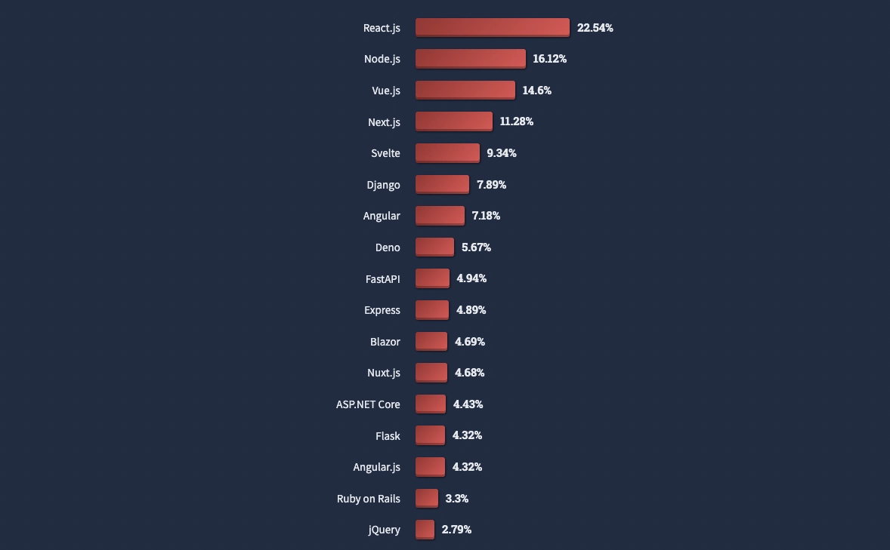

## Why I like Framer

The no code/ low code revolution is here. Right now low code or no code website builders are all the rage. “Anyone”, can build a site for a client an publish it to the web in record time. And there are a ton of options out there. I personally like Framer and here’s why. Framer gives us a lot of flexibility when it comes to design and development.

### React is very popular

According to the Stack Overflow survey in 2022, React is the most wanted framework developers use. Some of the world's most significant sites, like Facebook, Netflix, Yahoo, Codecademy, Dropbox, Airbnb, Asana, Microsoft, and Slack, use React. React is designed to be used at scale for large and small projects. If you notice, JQuery is at 2.79%, which is what a platform like Webflow uses.

React

### With a developer, normal React components can be used with Framer

The input box will fetch data from an API, a widespread practice on a site. This can easily be done with common fetch practices and fed into a custom code component. Here's a gist.

## You can build more complex interactions as well.

Component not only searches and filters but also animates using the Framer Motion library, or third party libraries like **AirTable**

## If you know Figma you can pick up Framer in no time

If you come from design background you are probably familiar tools like Sketch or Figma. Framer has a very similar interface to Sketch and Figma, so you will find it very easy to jump into “web development”, with a tool like Framer. This makes Framer a very popular choice with designers because of the lower barrier of entry.
