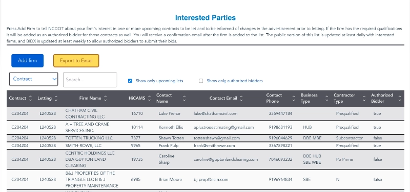

## Bidding & Letting

A site for business to track and register for state contracts.

### Need

Business 40 is a long-term construction project

### Solution

For government contractors, keeping track of updates to certain contracts they might be interested in was a manual process. One would have to call and provide different sets of information, and a paper pack related to said contract would be sent to them. Since it was a paper process, there was also no way to be automatically notified if the contract changed in any way.

A site needed to be developed that tracks contracts and allows users to easily find contracts based on various parameters.

The user also needed a way to register as interested so that they could receive automatic updates related to the contract or subcontract they were interested in.

Rest assured, the front end of this system is built with Vue and managed by SharePoint lists, ensuring a seamless user experience. Moreover, it is securely connected to various APIs, prioritizing the protection of user information.

Contract table

Registration form

