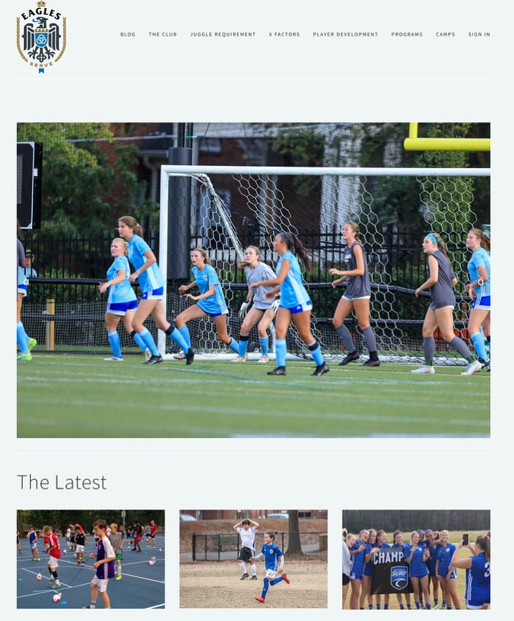

## Eagles RFC

A youth soccer club site redesign

### Need

The Eagles RFC website needed a temporary redesign and search engine overhaul before a marking push for tryouts. When searching for “youth soccer club Greensboro,” they were not displaying till the 9th page,

### Solution

A redesign of various pages not only gives visitors a compelling reason to choose this club over others but also makes it very easy to sign up for tryouts, and increasing search engine visibility.

The first major problem was the site's low visibility on Google. Being buried on the 9th page meant potential customers would never see their site. To address this, we first overhauled the site's metadata. We also conducted a competitive analysis to identify the strategies their competitors were using to rank higher. **Within 30 days, were were able to move them from the 9th page to the 1st page on Google.**

Next, we helped the club develop a set of core values that resonated with visitors. They needed to display why someone might choose them over other youth football clubs. From there, we developed clear explanations for these principles to be displayed on the site. We also developed a video talking about these core principles.

We also added a contact form to the first page and a separate Contact Us page to make a more vital call to action.

Last, we went through the site to clear up language that visitors or those not as familiar with soccer could more easily understand. Again, the goal is to lower a customer's potential barriers.

Home Page Before:

Home Page After:

Tryouts Page:

