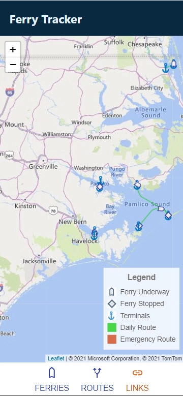
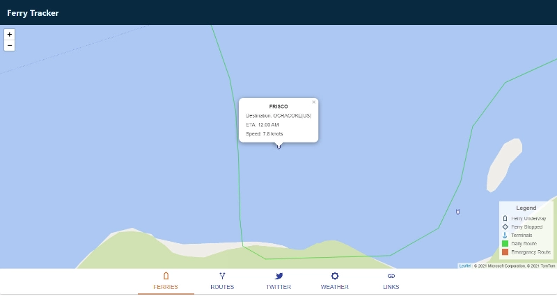
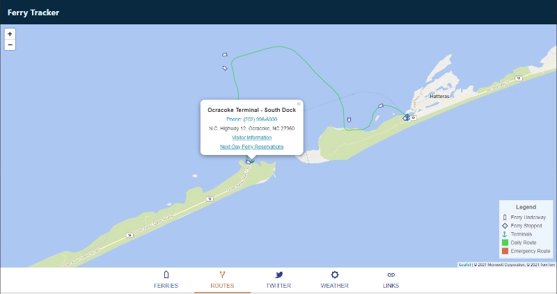
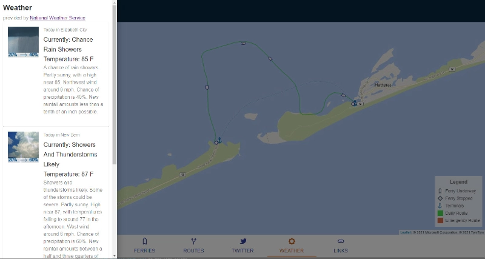

## Bidding & Letting

A mobile first site for tracking ferry locations and details

### Need

There was no way to track ferry movements including destinations and etas.

### Solution

Developed a mobile first site specifically to track ferries.

This site could also be used to get ferry terminal information, local weather conditions at the terminals, and the latest news for each terminal from twitter.

Unfortunately this site never made it to the public sphere because the goverment agency could not secure the funding they need to for the equiptment/hardware necessary to track the individual ferries

Mobile site

ferry selected

terminal selected

terminal weather

