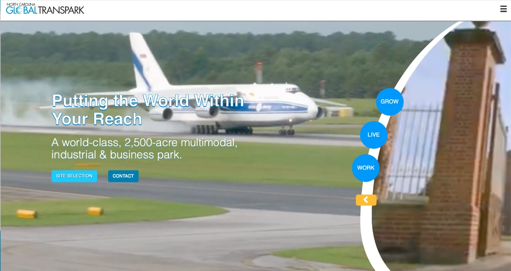
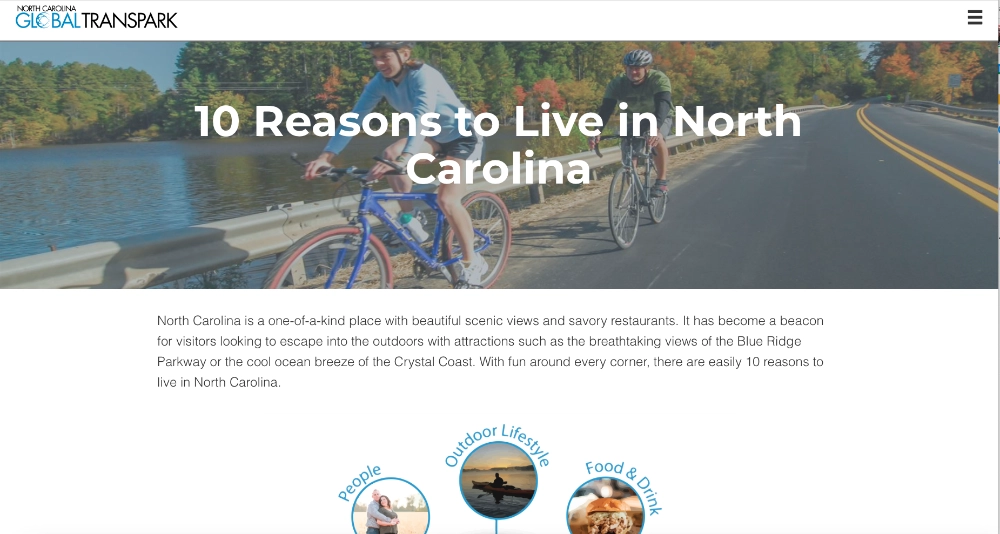
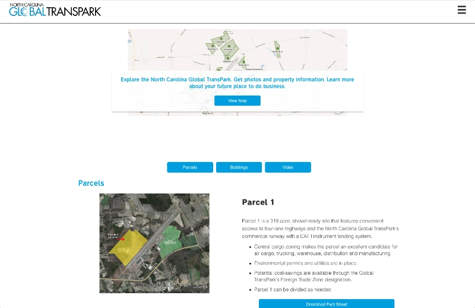
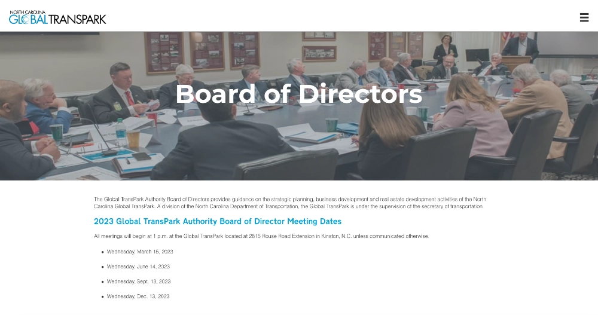

## Global TransPark

The North Carolina Global TransPark is a 2,500-acre, multi-modal industrial/airport site in Eastern North Carolina.

### Need

Global TransPark needed a way to attract potential new clients. While providing transparency to taxpayers.

### Solution

A new site was designed and build that emphasized the benefits of doing business the Global TransPark was easy to update for the client using a familiar CMS.

The customer wanted a hero that had dual videos continuously playing that showed the business and the personal benefits of moving one's business to Eastern North Carolina. A controller was added to reveal more of the video as necessary

Some of the pages were dedicated to living in North Carolina both for the business friendly nature of the state and the benefits to the employees moving there.

Since the park was primarily used as a large commercial real estate site, it was necessary to give potential companies as much information as possible about the lots and the amenities provided for each.

And because this was a public-private partnership project, the taxpayers needed full transparency on the dealings of the Global TransPark.

This project used SharePoint as the CMS, making it very easy for the customer to update and maintain a lot of it independently. Custom SharePoint templates allow individuals to generate press releases in Markup that would then be translated into web pages. The main page and some internal interactions were made with the Javascript framework Vue.
