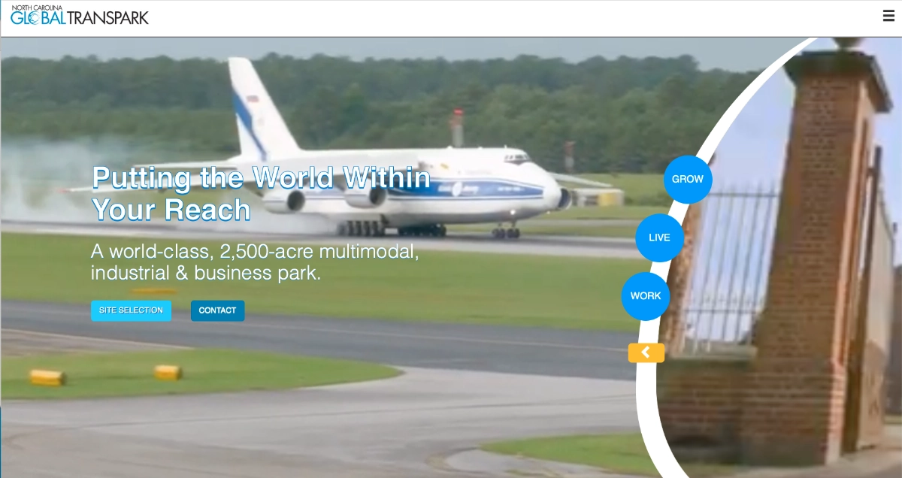
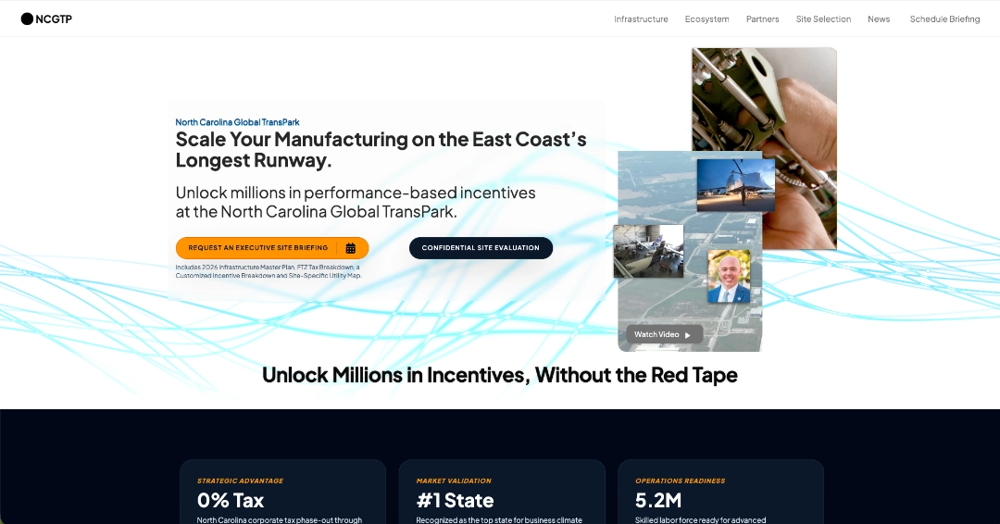
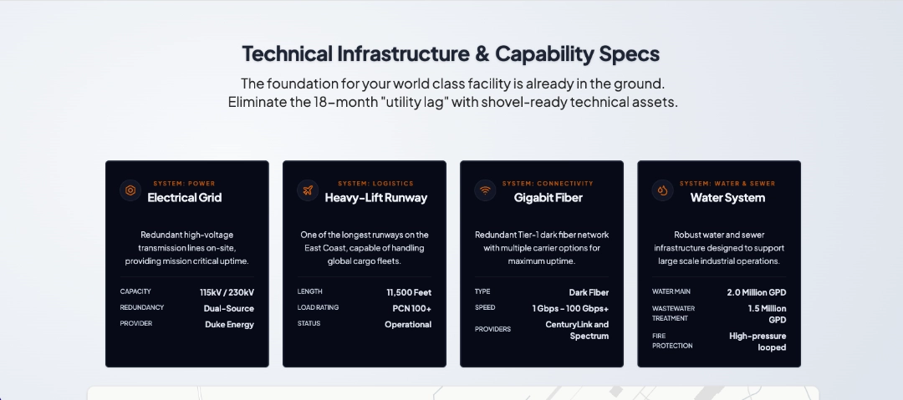

# Client: North Carolina Global TransPark

## Phase 1: The Revenue Audit (Identifying the "Invisibility Tax")
### The Invisible Friction
The original site ($ncgtp.com) acted as a barrier to entry. Site selectors—the primary persona—require rapid access to specific technical data. On the legacy site, that data was effectively hidden, creating a massive **Invisibility Tax on regional growth.**

- **_Data Friction:_** Critical specs (runway length, utility capacity, acreage) were buried in 20+ page PDF annual reports.
- **_Identity Crisis:_** The UI felt like a government regulatory body rather than a proactive business partner.
- **_Zero Mobile Utility:_** Maps and data tables were non-responsive, making on-site tours or quick mobile checks impossible.

## Phase 2: Technical Implementation (Architecting the "Friction-to-Flow" Logic)
Using the **Revenue Engine Architect** protocol, we pivoted the Information Architecture (IA) from Organizational Hierarchy (Board Minutes, History, Staff) to **User Intent** (Air, Rail, Road, Available Sites).

**_The "Friction vs. Flow" Audit_**
| Technical Category |	Legacy Site (Before) |	Redesign Proposal (After) |	Revenue Impact |
|---|---|---|---|
| Runway Specs |	Buried in "About" or PDFs. |	Hero Section Callout. |	High. Highlights the "Unfair Advantage" instantly.
| Site Availability |	Static, text-heavy lists. |	Visual Grid & Map UI. |	Critical. CEOs see "Where can I build?" in seconds.
| Infrastructure |	Hidden in Master Plans. |	High-Visibility Tables. |	Essential. Displays water/fiber capacity for manufacturing.
| Call to Action |	Passive footer link. |	Aggressive Header CTA. |	Conversion. Moves "Researcher" to "Lead."

### The Conversion Engine
The redesign replaces "Information Dumps" with **Sales Triggers**, ensuring every technical spec functions as a lead-generation node. 

**_Key UX Levers Applied:_**
- **_The 5-Second Grunt Test:_** Within 5 seconds, a visitor now knows exactly what the TransPark offers (Air/Rail/Road) and how to take the next step.
- **_The Headline Pivot:_** We moved from a generic title to a StoryBrand-style headline: **“Scale Your Industry Where Global Logistics Meet Shovel-Ready Land.”**
- **_Mobile-First Intelligence:_** All technical specs are now rendered in responsive HTML tables, ensuring site selectors can vet the park from a tablet during a site tour.

## Phase 3: Industrial ROI (The Economic Verdict)
In economic development, "Conversion" equals a **Letter of Intent (LOI).**

- **_The ROI Formula:_** (Current Traffic) x (1% Conversion Increase) x (Average Project Value) = **Annual Found Revenue.**

- **_The Verified Impact:_** With an average capital investment of **$32,000,000 per project** in Eastern NC, increasing the site's lead conversion by just 1% annually results in tens of millions of dollars in potential regional investment that was previously lost to competitors with inferior digital storefronts.

## The Verdict
By treating the NCGTP website as a sales tool rather than a record-keeping site, we eliminated the friction that costs rural regions jobs. The new architecture positions the TransPark as a world-class leader in aerospace and logistics, ready for **21st-century investment.**

Watch Full Video Breakdown

<iframe width="560" height="315" src="https://www.youtube.com/embed/QSXbUw8-_RM?si=xMzhVnlh21uJuRok" title="YouTube video player" frameborder="0" allow="accelerometer; autoplay; clipboard-write; encrypted-media; gyroscope; picture-in-picture; web-share" referrerpolicy="strict-origin-when-cross-origin" allowfullscreen></iframe>